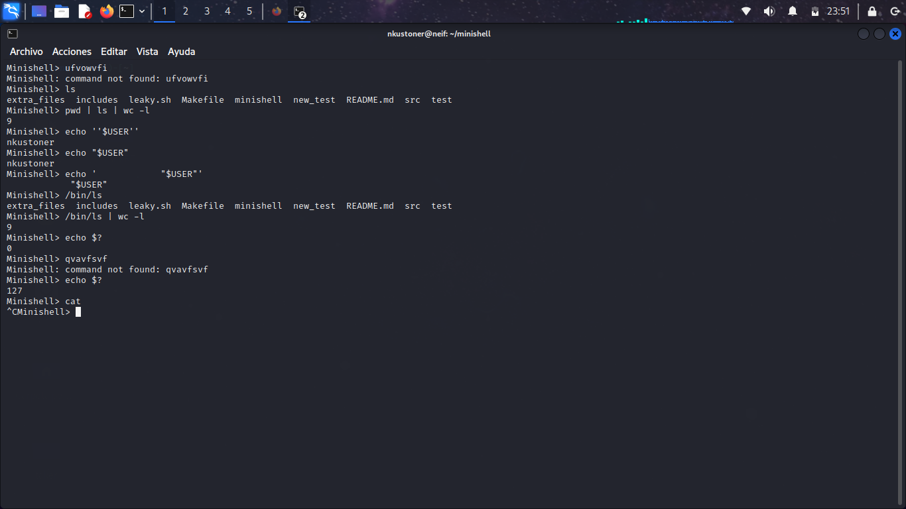

[](https://github.com/JaeSeoKim/badge42)

<p align="center"> 

</p>

# minishell

## What is minishell?
The existence of shells is linked to the very existence of IT.
At the time, all developers agreed that communicating with a computer using aligned
1/0 switches was seriously irritating.

It was only logical that they came up with the idea of creating a software to com-
municate with a computer using interactive lines of commands in a language somewhat
close to the human language.

The target of this project is to develope a shell based in bash in C language.

## How to use it
You can clone this repository by running the following command:
```bash
git clone https://github.com/NachoDonaire/minishell.git
```

Then, run the command make and, after a short wait, you will have an executable named minishell. You can run the following command:
```bash
make; ./minishell
```

You will notice you are in minishell when you see the prompt.

## Available options
Pipes, built-in commands (echo, cd, pwd, export, env) between other things. You can also run commands by absolute or relative path and try echo with quotes to see the parse.

There are also testfiles that you can indirect to the executable:
```bash
./minishell < extra_files/test_files/(the file of your choice)
```
Redirections, heredoc, signals like ctrl + C or ctrl + D are also handled.

## About the leaky file
leaky.sh is a script only available if you have de leak command which appears by default in iOS computers. This file checks the existence of memory leaks in the program once the program is running.

## Credit
The project was developed by @salaesteve2 and myself.
